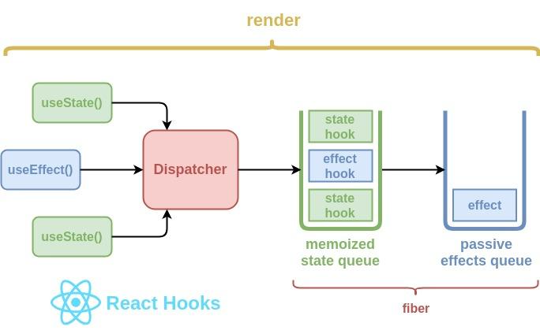

# React

# useState (state,setState)

state is behaviour and changes based on effects.
1.Initial state
2.Form field we are updating the state
3.When signup component useState hook sets the
initial state in memoized state queue ,

# useEffect --> (()=>{},[depedencies])

1.Mounting phase

- Runs once after the initial render (JSX),
- If dependecies are empty and not provided i.e second argument of useEffect as [] (empty array).

# Updating phase

- Runs only if dependencies are changed
  (()=>{}[emailChanged])

# Cleanup phase (optional phase)

(()=>{
return ()=>{
body for cleanup
conole.log("clean ups the effect)
}
})

- If useEffect function return another function , function acts as a cleanUp for the useEffect

# Unmount phase

- when the component required to be removed from DOM
- any clean up from effect runs if defined

            Component Mounts
                    ||
          UseEffect initialized
                    ||
        Effet runs based on dependencies
            every render on dependencies
            Once (if empty Array)
            OnDependency change ("specifiDepndendcies )                          ||
            cleanup (if apploicable)
       Runs before the next render on unmount
                   ||
            Component unmount
                   ||

  Effect cleanup executes if applicable

# Axios

1.  Promise based HTTP client for the browser
2.  It makes asynchronous http requests to REST endpoints and returns a promise.

        When component renders
                  ||
        Component mounts or updates
           It may trigger an API call
                   ||
         Axios request setup
           --> HTTP methods (GET , POST ,PUT , DELETE)
           --> URL - specifying the endpoints you are trying to reach
           --> OPTIONS - where request headers , request body , queryParams

                   ||
        Sending the axios request
                   ||
          Server response
           --> Server receives the request , process it and send back to the client
                   ||
          Handling Response
            --> Axios returns promise
            --> .then() => if fulfilled , .catch() => If error occured
            Promise chaining
               ||
          Updating componnet state
           --> using useState , setState to store the response data inside the component state
           --> which re-runs the componennt with passive effect
              ||

           Error handling
           --> If the server respond with error 400 , 500 etc
           --> Handle with try catch

# useForm & useFormState

To get started, install the library with npm i --save react-hook-form

Using it inside your component is super simple, import the useForm hook from the library
we will  use register and handleSubmit. Inside your functional component destructure them
